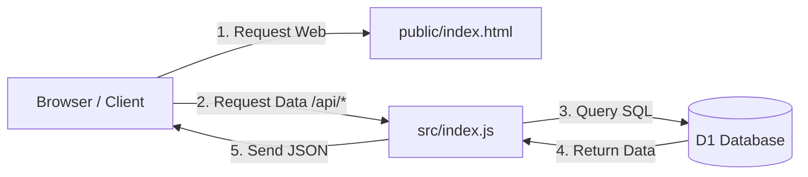

# Panduan Belajar: Menghubungkan Cloudflare D1 SQL dengan Workers

Selamat datang di modul praktikum Sistem Informasi Manajemen (MIS). Dalam panduan ini, kita akan belajar bagaimana membangun aplikasi web modern (dashboard akademik) yang terhubung langsung dengan database SQL serverless berbasis Cloudflare D1.

---

## 📋 Daftar Isi
1. [Prasyarat & Persiapan](#-prasyarat--persiapan)
2. [Langkah 1: Setup Project Lokal](#-langkah-1-setup-project-lokal)
3. [Langkah 2: Membuat Database Cloudflare D1](#-langkah-2-membuat-database-cloudflare-d1)
4. [Langkah 3: Membuat Struktur Tabel (Schema) & Data Dummy (Seed)](#-langkah-3-membuat-struktur-tabel-schema--data-dummy-seed)
5. [Langkah 4: Menjalankan Server Lokal](#-langkah-4-menjalankan-server-lokal)
6. [Langkah 5: Deploy ke Cloudflare (Production)](#-langkah-5-deploy-ke-cloudflare-production)
7. [Tugas Mandiri: Latihan SQL Query](#-tugas-mandiri-latihan-sql-query)
8. [Penyelesaian Masalah (Troubleshooting)](#-penyelesaian-masalah-troubleshooting)

---

## 🛠 Prasyarat & Persiapan
Sebelum mulai, pastikan Anda telah memiliki:
1. **Node.js** terinstal di komputer Anda (versi 18 atau terbaru).
2. Akun **Cloudflare** gratis.
3. Kode project yang sudah Anda download atau clone dari GitHub.

---

## 📂 Langkah 1: Setup Project Lokal
1. Buka terminal (atau Command Prompt) dan masuk ke direktori project:
   ```bash
   cd MIS-D1-SQL
   ```
2. Instal semua dependensi yang diperlukan:
   ```bash
   npm install
   ```

---

## 🏗 Konsep Arsitektur: /public vs /src (Frontend vs Backend)

Penting bagi mahasiswa untuk memahami mengapa project ini dibagi menjadi dua folder utama:

| Aspek | 📁 Folder `/public` (Frontend / Client-side) | 📁 Folder `/src` (Backend / Server-side) |
|---|---|---|
| **Definisi** | Tempat berkas statis yang dilihat dan berinteraksi langsung dengan pengguna. | Tempat logika bisnis, keamanan, dan pengolahan data server. |
| **Isi File** | `index.html` (HTML untuk struktur, CSS untuk desain, Javascript untuk interaksi browser). | `index.js` (kode JavaScript Worker yang berjalan di server Cloudflare). |
| **Lokasi Berjalan** | Dieksekusi di dalam **Browser Pengguna** (Chrome, Safari, Edge). | Dieksekusi di **Cloudflare Edge Server** (Serverless). |
| **Akses Database** | **Tidak Bisa** mengakses database D1 secara langsung (karena alasan keamanan). | **Bisa & Wajib** mengakses database D1 secara langsung menggunakan API Cloudflare (`env.akademik_db`). |
| **Keamanan** | Kode ini bersifat publik (siapa saja bisa melihat kode HTML/JS lewat *Inspect Element*). | Kode ini rahasia/aman (pengguna tidak bisa melihat isi kode di dalam `index.js`). |



---

## 🗄 Langkah 2: Membuat Database Cloudflare D1
Cloudflare D1 adalah database relasional SQL serverless yang berbasis SQLite.

1. Hubungkan terminal Anda ke akun Cloudflare dengan melakukan login:
   ```bash
   npx wrangler login
   ```
   *(Browser akan terbuka otomatis, silakan klik **Allow**).*

2. Buat database D1 baru bernama `akademik-db`:
   ```bash
   npx wrangler d1 create akademik-db
   ```
3. Terminal akan menampilkan output konfigurasi seperti ini:
   ```json
   [[d1_databases]]
   binding = "DB"
   database_name = "akademik-db"
   database_id = "xxxxxxxx-xxxx-xxxx-xxxx-xxxxxxxxxxxx"
   ```
4. Buka file `wrangler.jsonc` di text editor Anda, lalu pastikan isinya telah disesuaikan dengan konfigurasi database Anda:
   ```json
    {
      "name": "akademik-dashboard",
      "main": "src/index.js",
      "compatibility_date": "2026-06-30",
      "assets": {
        "directory": "./public"
      },
      "d1_databases": [
        {
          "binding": "akademik_db",
          "database_name": "akademik-db",
          "database_id": "MASUKKAN_DATABASE_ID_ANDA_DISINI"
        }
      ]
    }
   ```
   > 💡 **PENTING**: Pastikan nama binding adalah `"akademik_db"` karena kode JavaScript backend kita memanggil database menggunakan nama tersebut.

---

## 🏗 Langkah 3: Membuat Struktur Tabel (Schema) & Data Dummy (Seed)
Kita memiliki dua file SQL di dalam folder `db/`:
* `db/schema.sql` (untuk membuat tabel: Fakultas, Prodi, Mahasiswa, Mata Kuliah, KRS).
* `db/seed.sql` (untuk memasukkan 50 baris data dummy mahasiswa dan nilai akademik).

### A. Eksekusi Secara Lokal (Untuk Simulasi Komputer Sendiri)
Jalankan perintah berikut untuk mengisi database simulasi lokal:
```bash
# 1. Membuat struktur tabel
npx wrangler d1 execute akademik-db --local --file=./db/schema.sql

# 2. Memasukkan data dummy mahasiswa & nilai
npx wrangler d1 execute akademik-db --local --file=./db/seed.sql
```

### B. Eksekusi di Cloud / Production (Database Cloudflare Asli)
Jika ingin mengunggah data ini ke server Cloudflare D1 yang berada di internet:
```bash
# 1. Membuat tabel di cloud
npx wrangler d1 execute akademik-db --remote --file=./db/schema.sql

# 2. Memasukkan data ke cloud
npx wrangler d1 execute akademik-db --remote --file=./db/seed.sql
```

---

## 💻 Langkah 4: Menjalankan Server Lokal
Mari kita uji aplikasi dashboard kita secara lokal di komputer:
```bash
npm run dev
```
Setelah server menyala, buka browser Anda dan akses:
👉 **[http://localhost:8787](http://localhost:8787)**

Anda akan melihat dashboard akademik yang interaktif dengan grafik dan tabel pencarian data mahasiswa yang diambil langsung dari database lokal D1.

---

## 🚀 Langkah 5: Deploy ke Cloudflare (Production)
Agar aplikasi Anda dapat diakses oleh publik (online di internet), deploy project ke Cloudflare Workers:
```bash
npm run deploy
```
Wrangler akan memberikan Anda link URL publik (contoh: `https://akademik-dashboard.username.workers.dev`). 

---

## ✍️ Tugas Mandiri: Latihan SQL Query
Buka menu database pada Cloudflare Dashboard Anda, atau gunakan terminal lokal untuk mempraktikkan query berikut.

### Tantangan 1: Analisis Hubungan Antar Tabel (JOIN)
Menampilkan daftar mahasiswa lengkap dengan nama Program Studi dan Fakultas mereka.
```sql
SELECT 
    m.nim, 
    m.nama, 
    p.nama_prodi, 
    f.singkatan AS fakultas
FROM mahasiswa m
JOIN prodi p ON m.prodi_id = p.id
JOIN fakultas f ON p.fakultas_id = f.id;
```

### Tantangan 2: Agregasi Kelompok Data (GROUP BY & COUNT)
Menghitung jumlah mahasiswa aktif yang terdaftar di masing-masing Program Studi.
```sql
SELECT 
    p.nama_prodi, 
    COUNT(m.nim) AS total_mahasiswa
FROM prodi p
LEFT JOIN mahasiswa m ON p.id = m.prodi_id AND m.status = 'Aktif'
GROUP BY p.nama_prodi;
```

### Tantangan 3: Studi Kasus Konversi Grade & IPS (CASE WHEN & Math)
Menghitung Indeks Prestasi Semester (IPS) rata-rata mahasiswa dengan mengonversi nilai huruf menjadi bobot angka (A = 4.0, AB = 3.5, B = 3.0, dst.).
```sql
SELECT 
    m.nim, 
    m.nama, 
    ROUND(SUM(
        CASE k.nilai_huruf
            WHEN 'A'  THEN 4.0 * mk.sks
            WHEN 'AB' THEN 3.5 * mk.sks
            WHEN 'B'  THEN 3.0 * mk.sks
            WHEN 'BC' THEN 2.5 * mk.sks
            WHEN 'C'  THEN 2.0 * mk.sks
            WHEN 'D'  THEN 1.0 * mk.sks
            ELSE 0.0
        END
    ) / SUM(mk.sks), 2) AS ips
FROM krs k
JOIN mahasiswa m ON k.nim = m.nim
JOIN mata_kuliah mk ON k.kode_mk = mk.kode_mk
GROUP BY m.nim, m.nama;
```

---

## ❓ Penyelesaian Masalah (Troubleshooting)

### 🔴 Error: `D1_ERROR: no such table: mahasiswa`
**Penyebab**: Anda belum membuat tabel di database yang aktif (lokal/remote).
**Solusi**: Pastikan Anda telah menjalankan perintah `npx wrangler d1 execute akademik-db --file=./db/schema.sql` (tambahkan `--local` jika mengetes di komputer sendiri).

### 🔴 Error: `Cannot read properties of undefined (reading 'prepare')` atau Binding hilang di Web UI
**Penyebab**: Koneksi binding antara kode JavaScript `env.akademik_db` dengan database di Cloudflare terputus.
**Solusi**: 
1. Jalankan kembali perintah `npm run deploy`. Proses deploy secara otomatis membaca file `wrangler.jsonc` dan menghubungkan ulang binding.
2. Atau masuk ke Cloudflare Dashboard -> **Workers & Pages** -> Pilih worker Anda -> **Settings** -> **Bindings** -> Tambahkan binding D1 dengan nama variabel `akademik_db` dan arahkan ke database `akademik-db`.
